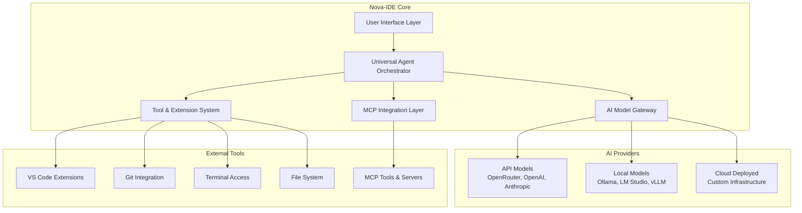

# Nova-IDE Design Document

## Overview

Nova-IDE is a next-generation AI-powered Integrated Development Environment that bridges the gap between VOID IDE's comprehensive model support and Kiro IDE's sophisticated agentic capabilities. The system creates a universal autopilot layer that works with any AI model (API-based, local, or cloud-deployed) while providing Claude 4.1-style autonomous development assistance.

The architecture leverages proven patterns from multiple advanced IDE implementations:
- **VOID IDE**: Model-agnostic API integration and UI patterns
- **Kiro IDE**: Specification-driven development and agent orchestration
- **VS Code**: Extension system and editor integration
- **OpenHands**: Agent architecture and task decomposition
- **AutoGPT**: Autonomous goal pursuit and recursive problem-solving
- **Goose MCP**: Model Context Protocol integration for tool ecosystems

## Architecture

### High-Level System Architecture



### Core Components Architecture

The system follows a layered architecture with clear separation of concerns:

#### 1. User Interface Layer
- **Editor Integration**: Enhanced VS Code-based editor with AI-powered features
- **Chat Panel**: Universal agent conversation interface with reasoning visualization
- **Agent Dashboard**: Real-time monitoring of agent activities and model usage
- **Project Explorer**: Intelligent file navigation with AI-powered insights

#### 2. Universal Agent Orchestrator
The heart of Nova-IDE's intelligence, providing Claude-style autopilot capabilities for any model:

```typescript
interface UniversalAgentOrchestrator {
  // Core agent loop
  executeTask(task: Task, context: AgentContext): Promise<TaskResult>
  
  // Multi-model orchestration
  orchestrateAgents(task: ComplexTask): Promise<AgentTeam>
  
  // Reasoning and planning
  createExecutionPlan(goal: string): ExecutionPlan
  
  // Context management
  maintainContext(session: AgentSession): void
}
```

#### 3. AI Model Gateway
Universal abstraction layer supporting all model types:

```typescript
interface AIModelGateway {
  // Universal model interface
  sendMessage(request: ModelRequest): Promise<ModelResponse>
  streamMessage(request: ModelRequest): AsyncIterator<ModelChunk>
  
  // Model management
  listAvailableModels(): Promise<ModelInfo[]>
  selectOptimalModel(task: TaskType): Promise<ModelSelection>
  
  // Cost optimization
  estimateCost(request: ModelRequest): Promise<CostEstimate>
  optimizeForBudget(budget: Budget): ModelStrategy
}
```

#### 4. MCP Integration Layer
Following Goose patterns for tool ecosystem integration:

```typescript
interface MCPIntegration {
  // MCP server management
  discoverServers(): Promise<MCPServer[]>
  connectToServer(server: MCPServer): Promise<MCPConnection>
  
  // Tool orchestration
  listAvailableTools(): Promise<MCPTool[]>
  executeTool(tool: MCPTool, params: ToolParams): Promise<ToolResult>
  
  // Agent-tool integration
  integrateWithAgent(agent: Agent, tools: MCPTool[]): void
}
```

## Components and Interfaces

### 1. Universal Agent Orchestrator

The core intelligence system that provides autopilot capabilities for any AI model:

#### Agent Loop Implementation
```typescript
class UniversalAgentOrchestrator {
  async executeAgentLoop(task: Task): Promise<TaskResult> {
    let context = await this.initializeContext(task)
    
    while (!context.isComplete) {
      // Thought: Analyze current situation
      const thought = await this.think(context)
      
      // Plan: Create action plan
      const plan = await this.plan(thought, context)
      
      // Act: Execute actions using available tools
      const action = await this.act(plan, context)
      
      // Observe: Analyze results
      const observation = await this.observe(action, context)
      
      // Reflect: Update understanding and context
      context = await this.reflect(observation, context)
    }
    
    return context.result
  }
  
  private async think(context: AgentContext): Promise<Thought> {
    const model = await this.selectThinkingModel(context)
    return await model.analyze(context.currentState)
  }
  
  private async plan(thought: Thought, context: AgentContext): Promise<Plan> {
    const model = await this.selectPlanningModel(context)
    return await model.createPlan(thought, context.goal)
  }
  
  private async act(plan: Plan, context: AgentContext): Promise<Action> {
    const tools = await this.selectTools(plan)
    const model = await this.selectExecutionModel(plan)
    return await model.executeWithTools(plan, tools)
  }
}
```

#### Multi-Model Orchestration
```typescript
class MultiModelOrchestrator {
  async orchestrateTask(task: ComplexTask): Promise<TaskResult> {
    // Decompose task into subtasks
    const subtasks = await this.decomposeTask(task)
    
    // Assign optimal models to each subtask
    const assignments = await this.assignModels(subtasks)
    
    // Execute subtasks in parallel/sequence as needed
    const results = await this.executeSubtasks(assignments)
    
    // Synthesize final result
    return await this.synthesizeResults(results, task)
  }
  
  private async assignModels(subtasks: SubTask[]): Promise<ModelAssignment[]> {
    return subtasks.map(subtask => ({
      subtask,
      model: this.selectOptimalModel(subtask),
      priority: this.calculatePriority(subtask),
      dependencies: this.findDependencies(subtask)
    }))
  }
}
```

### 2. AI Model Gateway

Universal interface supporting all model deployment methods:

#### Provider Abstraction
```typescript
abstract class BaseAIProvider {
  abstract async sendMessage(request: ModelRequest): Promise<ModelResponse>
  abstract async streamMessage(request: ModelRequest): AsyncIterator<ModelChunk>
  abstract async listModels(): Promise<ModelInfo[]>
  abstract async estimateCost(request: ModelRequest): Promise<number>
}

class OpenRouterProvider extends BaseAIProvider {
  // Implementation for OpenRouter API
}

class OllamaProvider extends BaseAIProvider {
  // Implementation for local Ollama models
}

class CustomCloudProvider extends BaseAIProvider {
  // Implementation for custom cloud deployments
}
```

#### Intelligent Model Selection
```typescript
class ModelSelector {
  async selectOptimalModel(task: TaskAnalysis): Promise<ModelSelection> {
    const candidates = await this.getAvailableModels()
    const scored = await this.scoreModels(candidates, task)
    
    return this.optimizeSelection(scored, {
      costWeight: 0.4,
      performanceWeight: 0.4,
      availabilityWeight: 0.2
    })
  }
  
  private async scoreModels(models: ModelInfo[], task: TaskAnalysis): Promise<ScoredModel[]> {
    return Promise.all(models.map(async model => ({
      model,
      costScore: await this.calculateCostScore(model, task),
      performanceScore: await this.calculatePerformanceScore(model, task),
      availabilityScore: await this.calculateAvailabilityScore(model)
    })))
  }
}
```

### 3. MCP Integration System

Following Goose patterns for comprehensive tool integration:

#### MCP Server Management
```typescript
class MCPServerManager {
  private servers: Map<string, MCPConnection> = new Map()
  
  async discoverAndConnect(): Promise<void> {
    // Auto-discover MCP servers
    const servers = await this.discoverServers()
    
    // Connect to each server
    for (const server of servers) {
      try {
        const connection = await this.connectToServer(server)
        this.servers.set(server.name, connection)
      } catch (error) {
        console.warn(`Failed to connect to MCP server ${server.name}:`, error)
      }
    }
  }
  
  async getAvailableTools(): Promise<MCPTool[]> {
    const tools: MCPTool[] = []
    
    for (const [serverName, connection] of this.servers) {
      try {
        const serverTools = await connection.listTools()
        tools.push(...serverTools.map(tool => ({
          ...tool,
          serverName,
          connection
        })))
      } catch (error) {
        console.warn(`Failed to list tools from ${serverName}:`, error)
      }
    }
    
    return tools
  }
}
```

#### Agent-Tool Integration
```typescript
class AgentToolIntegration {
  async integrateToolsWithAgent(agent: Agent, availableTools: MCPTool[]): Promise<void> {
    // Filter tools based on agent capabilities and task requirements
    const relevantTools = this.filterRelevantTools(availableTools, agent.context)
    
    // Create tool execution wrappers
    const toolWrappers = relevantTools.map(tool => this.createToolWrapper(tool))
    
    // Register tools with agent
    agent.registerTools(toolWrappers)
  }
  
  private createToolWrapper(tool: MCPTool): ToolWrapper {
    return {
      name: tool.name,
      description: tool.description,
      parameters: tool.parameters,
      execute: async (params: any) => {
        try {
          return await tool.connection.executeTool(tool.name, params)
        } catch (error) {
          return { error: error.message, success: false }
        }
      }
    }
  }
}
```

### 4. Extension and Plugin System

Comprehensive extension architecture supporting multiple plugin types:

#### Extension Manager
```typescript
class ExtensionManager {
  private extensions: Map<string, Extension> = new Map()
  private marketplace: ExtensionMarketplace
  
  async loadExtension(extensionPath: string): Promise<void> {
    const manifest = await this.loadManifest(extensionPath)
    const extension = await this.createExtension(manifest, extensionPath)
    
    // Security validation
    await this.validateExtension(extension)
    
    // Sandbox creation
    const sandbox = await this.createSandbox(extension)
    
    // Load and activate
    await extension.load(sandbox)
    this.extensions.set(extension.id, extension)
  }
  
  async installFromMarketplace(extensionId: string): Promise<void> {
    const extensionInfo = await this.marketplace.getExtension(extensionId)
    const downloadPath = await this.marketplace.download(extensionInfo)
    await this.loadExtension(downloadPath)
  }
}
```

### 5. User Interface Components

#### Agent Visualization Panel
```typescript
class AgentVisualizationPanel {
  private thoughtDisplay: ThoughtDisplay
  private planDisplay: PlanDisplay
  private actionDisplay: ActionDisplay
  private observationDisplay: ObservationDisplay
  
  updateAgentState(state: AgentState): void {
    this.thoughtDisplay.update(state.currentThought)
    this.planDisplay.update(state.currentPlan)
    this.actionDisplay.update(state.currentAction)
    this.observationDisplay.update(state.lastObservation)
  }
  
  showReasoningLoop(loop: ReasoningLoop): void {
    // Visualize the agent's reasoning process
    this.renderReasoningFlow(loop.steps)
    this.highlightCurrentStep(loop.currentStep)
    this.showDecisionPoints(loop.decisions)
  }
}
```

#### Universal Chat Interface
```typescript
class UniversalChatInterface {
  private conversationManager: ConversationManager
  private contextManager: ContextManager
  private modelSelector: ModelSelector
  
  async sendMessage(message: string, context?: ChatContext): Promise<void> {
    // Prepare context
    const fullContext = await this.contextManager.prepareContext(context)
    
    // Select optimal model
    const model = await this.modelSelector.selectForChat(message, fullContext)
    
    // Send message and handle response
    const response = await model.sendMessage({
      message,
      context: fullContext,
      stream: true
    })
    
    // Update conversation
    await this.conversationManager.addExchange(message, response)
  }
}
```

## Data Models

### Core Data Structures

#### Agent Context
```typescript
interface AgentContext {
  sessionId: string
  goal: string
  currentState: AgentState
  history: AgentAction[]
  availableTools: Tool[]
  workspaceContext: WorkspaceContext
  conversationHistory: Message[]
  scratchpad: ScratchpadEntry[]
}

interface AgentState {
  phase: 'thinking' | 'planning' | 'acting' | 'observing' | 'reflecting'
  currentThought?: Thought
  currentPlan?: Plan
  currentAction?: Action
  lastObservation?: Observation
  confidence: number
  nextSteps: string[]
}
```

#### Model Configuration
```typescript
interface ModelConfiguration {
  id: string
  name: string
  provider: 'openrouter' | 'ollama' | 'openai' | 'anthropic' | 'custom'
  endpoint: string
  apiKey?: string
  capabilities: ModelCapabilities
  costPerToken: number
  maxTokens: number
  contextWindow: number
}

interface ModelCapabilities {
  supportsStreaming: boolean
  supportsFunctionCalling: boolean
  supportsVision: boolean
  supportsCodeGeneration: boolean
  supportsReasoning: boolean
  languages: string[]
  specializations: string[]
}
```

#### Task Definitions
```typescript
interface Task {
  id: string
  type: TaskType
  description: string
  requirements: string[]
  context: TaskContext
  priority: Priority
  estimatedComplexity: ComplexityLevel
  dependencies: string[]
}

interface ComplexTask extends Task {
  subtasks: SubTask[]
  orchestrationStrategy: OrchestrationStrategy
  modelRequirements: ModelRequirement[]
}
```

#### MCP Integration Models
```typescript
interface MCPServer {
  name: string
  version: string
  endpoint: string
  capabilities: MCPCapabilities
  tools: MCPToolDefinition[]
}

interface MCPTool {
  name: string
  description: string
  parameters: JSONSchema
  serverName: string
  connection: MCPConnection
}

interface MCPConnection {
  server: MCPServer
  status: 'connected' | 'disconnected' | 'error'
  lastHeartbeat: Date
  executeTool(toolName: string, params: any): Promise<ToolResult>
  listTools(): Promise<MCPToolDefinition[]>
}
```

## Error Handling

### Comprehensive Error Recovery System

#### Model Failure Handling
```typescript
class ModelFailureHandler {
  async handleModelFailure(
    originalRequest: ModelRequest,
    failedModel: ModelInfo,
    error: ModelError
  ): Promise<ModelResponse> {
    // Log failure for analysis
    await this.logFailure(failedModel, error)
    
    // Find alternative models
    const alternatives = await this.findAlternativeModels(originalRequest, failedModel)
    
    // Try alternatives in order of preference
    for (const alternative of alternatives) {
      try {
        return await alternative.sendMessage(originalRequest)
      } catch (alternativeError) {
        await this.logFailure(alternative, alternativeError)
        continue
      }
    }
    
    // If all models fail, use degraded mode
    return await this.handleDegradedMode(originalRequest)
  }
  
  private async findAlternativeModels(
    request: ModelRequest,
    failedModel: ModelInfo
  ): Promise<ModelInfo[]> {
    const allModels = await this.modelGateway.listAvailableModels()
    
    return allModels
      .filter(model => model.id !== failedModel.id)
      .filter(model => this.canHandleRequest(model, request))
      .sort((a, b) => this.calculateSimilarity(b, failedModel) - this.calculateSimilarity(a, failedModel))
  }
}
```

#### Agent Recovery System
```typescript
class AgentRecoverySystem {
  async recoverFromAgentFailure(
    agent: Agent,
    context: AgentContext,
    error: AgentError
  ): Promise<AgentContext> {
    switch (error.type) {
      case 'model_failure':
        return await this.recoverFromModelFailure(agent, context, error)
      
      case 'tool_failure':
        return await this.recoverFromToolFailure(agent, context, error)
      
      case 'context_corruption':
        return await this.recoverFromContextCorruption(agent, context, error)
      
      case 'infinite_loop':
        return await this.recoverFromInfiniteLoop(agent, context, error)
      
      default:
        return await this.performGeneralRecovery(agent, context, error)
    }
  }
  
  private async recoverFromModelFailure(
    agent: Agent,
    context: AgentContext,
    error: AgentError
  ): Promise<AgentContext> {
    // Switch to backup model
    const backupModel = await this.selectBackupModel(context)
    agent.switchModel(backupModel)
    
    // Restore context with new model
    const restoredContext = await this.restoreContextForModel(context, backupModel)
    
    // Resume from last successful step
    return await this.resumeFromLastCheckpoint(agent, restoredContext)
  }
}
```

### MCP Error Handling
```typescript
class MCPErrorHandler {
  async handleMCPError(
    tool: MCPTool,
    params: any,
    error: MCPError
  ): Promise<ToolResult> {
    switch (error.type) {
      case 'connection_lost':
        return await this.handleConnectionLoss(tool, params, error)
      
      case 'tool_not_found':
        return await this.handleToolNotFound(tool, params, error)
      
      case 'invalid_parameters':
        return await this.handleInvalidParameters(tool, params, error)
      
      case 'execution_timeout':
        return await this.handleExecutionTimeout(tool, params, error)
      
      default:
        return { success: false, error: error.message }
    }
  }
  
  private async handleConnectionLoss(
    tool: MCPTool,
    params: any,
    error: MCPError
  ): Promise<ToolResult> {
    // Attempt to reconnect
    try {
      await tool.connection.reconnect()
      return await tool.connection.executeTool(tool.name, params)
    } catch (reconnectError) {
      // Find alternative tool
      const alternativeTool = await this.findAlternativeTool(tool)
      if (alternativeTool) {
        return await alternativeTool.connection.executeTool(alternativeTool.name, params)
      }
      
      return { success: false, error: 'No alternative tool available' }
    }
  }
}
```

## Testing Strategy

### Comprehensive Testing Framework

#### Unit Testing
```typescript
describe('UniversalAgentOrchestrator', () => {
  let orchestrator: UniversalAgentOrchestrator
  let mockModelGateway: jest.Mocked<AIModelGateway>
  let mockToolManager: jest.Mocked<ToolManager>
  
  beforeEach(() => {
    mockModelGateway = createMockModelGateway()
    mockToolManager = createMockToolManager()
    orchestrator = new UniversalAgentOrchestrator(mockModelGateway, mockToolManager)
  })
  
  describe('executeAgentLoop', () => {
    it('should complete simple tasks with single model', async () => {
      const task = createSimpleTask('Generate a hello world function')
      const result = await orchestrator.executeAgentLoop(task)
      
      expect(result.success).toBe(true)
      expect(result.output).toContain('hello world')
    })
    
    it('should orchestrate multiple models for complex tasks', async () => {
      const task = createComplexTask('Build a REST API with tests')
      const result = await orchestrator.executeAgentLoop(task)
      
      expect(result.success).toBe(true)
      expect(mockModelGateway.sendMessage).toHaveBeenCalledTimes(3) // Planning, coding, testing
    })
    
    it('should recover from model failures', async () => {
      mockModelGateway.sendMessage.mockRejectedValueOnce(new Error('Model unavailable'))
      
      const task = createSimpleTask('Write a function')
      const result = await orchestrator.executeAgentLoop(task)
      
      expect(result.success).toBe(true) // Should succeed with backup model
    })
  })
})
```

#### Integration Testing
```typescript
describe('Nova-IDE Integration Tests', () => {
  let ide: NovaIDE
  
  beforeEach(async () => {
    ide = await NovaIDE.create({
      projectPath: 'C:\\Users\\System777\\Downloads\\IDE\\Final IDE\\Nova-IDE',
      testMode: true
    })
  })
  
  describe('Multi-Model Orchestration', () => {
    it('should coordinate OpenRouter and local models', async () => {
      const task = 'Create a TypeScript class with comprehensive tests'
      const result = await ide.executeTask(task)
      
      expect(result.files).toHaveLength(2) // Class file and test file
      expect(result.modelsUsed).toContain('deepseek-coder')
      expect(result.modelsUsed).toContain('local-codellama')
    })
  })
  
  describe('MCP Integration', () => {
    it('should discover and use MCP tools', async () => {
      const tools = await ide.mcpManager.discoverTools()
      expect(tools.length).toBeGreaterThan(0)
      
      const result = await ide.executeMCPTool('git-status', {})
      expect(result.success).toBe(true)
    })
  })
})
```

#### End-to-End Testing
```typescript
describe('Nova-IDE E2E Tests', () => {
  describe('Complete Development Workflow', () => {
    it('should handle full project creation workflow', async () => {
      // Start with natural language request
      const request = 'Create a Node.js Express API with user authentication'
      
      // Agent should plan the project
      const plan = await ide.agent.createPlan(request)
      expect(plan.steps).toHaveLength(5)
      
      // Execute the plan
      const result = await ide.agent.executePlan(plan)
      
      // Verify project structure
      expect(result.files).toContain('package.json')
      expect(result.files).toContain('src/app.js')
      expect(result.files).toContain('src/auth/auth.js')
      expect(result.files).toContain('tests/auth.test.js')
      
      // Verify the application works
      const testResult = await ide.runTests()
      expect(testResult.passed).toBe(true)
    })
  })
})
```

This design document provides a comprehensive architecture for Nova-IDE that addresses all requirements while incorporating the MCP layer and Goose-style patterns you mentioned. The system creates a universal autopilot layer that works with any AI model deployment method, filling the gap you identified in VOID IDE.
